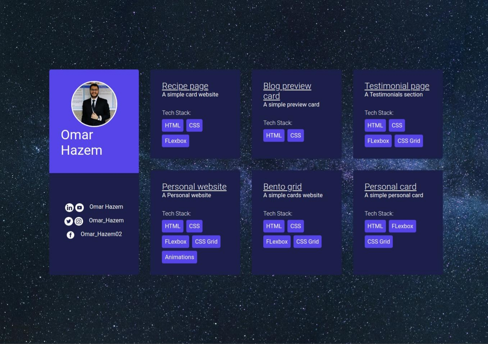
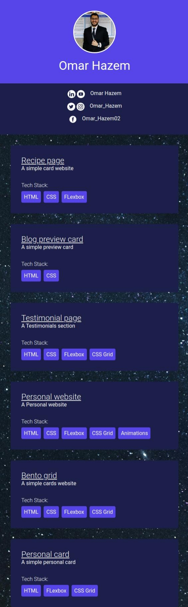

# Personal Website Dashboard 💼

This is a simple personal website that showcases my projects in **card format**.  
I built it using **HTML , CSS and Sass** as practice to master **Flexbox** and **CSS Grid**.

---

## ✨ Features
- Responsive design 📱  
- Clean and minimal project cards  
- Focused on layout techniques (Grid & Flexbox)  

---

## 🚀 Live Demo
[👉 Click here to view the project](https://omarhazem02.github.io/Personal-website-cards/)

---

## 🛠️ Purpose
The main goal of this project was to:
- Practice **HTML structure planning**  
- Deepen knowledge in **CSS Grid & Flexbox**  
- Improve layout and design skills  

---

## 🔮 Future Development
- Add more projects  
- Experiment with animations and transitions  
- Make it more interactive  

---

## 🖼️ Screenshot
### 🖥️ Desktop Version

### 📱 Mobile Version

